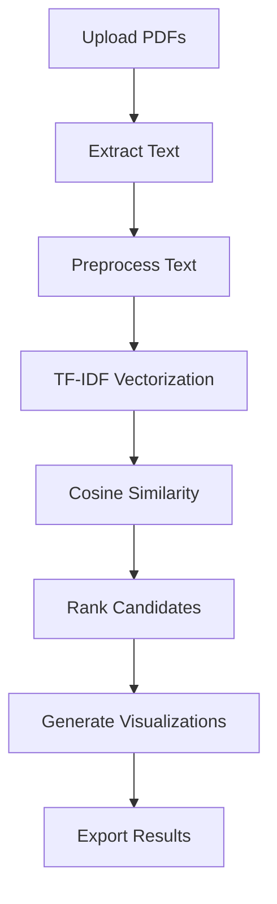

# 🎯 AI Resume Screening & Candidate Ranking 


An intelligent AI-powered web application that automates resume screening and candidate ranking using **Natural Language Processing** and **Machine Learning** techniques. Built with Streamlit for an intuitive user experience.

## 📋 Table of Contents

- [🎯 AI Resume Screening \& Candidate Ranking System](#-ai-resume-screening--candidate-ranking-system)
  - [📋 Table of Contents](#-table-of-contents)
  - [✨ Features](#-features)
  - [🚀 Demo](#-demo)
  - [🛠️ Technology Stack](#️-technology-stack)
  - [📊 How It Works](#-how-it-works)
  - [🔧 Installation](#-installation)
  - [📸 Screenshots](#-screenshots)
  - [🎨 Key Features](#-key-features)
  - [📈 Results Analysis](#-results-analysis)
  - [🎯 Use Cases](#-use-cases)
  - [📝 License](#-license)

## ✨ Features

🎯 **Smart Resume Ranking** - AI-powered candidate scoring using TF-IDF and Cosine Similarity  
📄 **PDF Text Extraction** - Automated text extraction from PDF resumes  
⚙️ **Configurable Thresholds** - Adjustable similarity thresholds for filtering  
🔍 **Skills Analysis** - Automatic skill detection and correlation analysis  
📊 **Interactive Visualizations** - Dynamic charts and graphs using Plotly  
📋 **Comprehensive Reports** - Downloadable CSV reports with detailed analytics  
🎨 **Modern UI** - Clean, responsive interface built with Streamlit  
⚡ **Real-time Processing** - Live progress tracking and status updates  

## 🚀 Demo

The application provides an intuitive web interface where HR professionals can:

1. **Enter job descriptions** with specific requirements
2. **Upload multiple PDF resumes** simultaneously
3. **Configure analysis parameters** through the sidebar
4. **View ranked results** with interactive visualizations
5. **Download comprehensive reports** for further analysis

## 🛠️ Technology Stack

| Component | Technology | Purpose |
|-----------|------------|---------|
| **Frontend** | Streamlit | Interactive web interface |
| **Backend** | Python 3.8+ | Core application logic |
| **ML/NLP** | Scikit-learn | TF-IDF vectorization & similarity |
| **PDF Processing** | PyPDF2 | Text extraction from PDFs |
| **Data Analysis** | Pandas, NumPy | Data manipulation & analysis |
| **Visualization** | Plotly, Matplotlib, Seaborn | Interactive charts & graphs |
| **Export** | CSV | Report generation |

## 📊 How It Works



1. **Text Extraction**: PDFs are processed using PyPDF2 to extract readable text
2. **Preprocessing**: Text is cleaned, normalized, and prepared for analysis
3. **Vectorization**: TF-IDF converts text to numerical vectors
4. **Similarity Calculation**: Cosine similarity measures job-resume alignment
5. **Ranking**: Candidates are sorted by similarity scores
6. **Visualization**: Results are presented through interactive charts
7. **Export**: Comprehensive reports are generated for download

## 🔧 Installation

### Prerequisites
- Python 3.8 or higher
- pip package manager

### Step 1: Clone the Repository
```bash
git clone https://github.com/yourusername/ai-resume-screening.git
cd ai-resume-screening
```

### Step 2: Create Virtual Environment
```bash
# Create virtual environment
python -m venv resume_screening_env

# Activate virtual environment
# On Windows:
resume_screening_env\Scripts\activate
# On macOS/Linux:
source resume_screening_env/bin/activate
```

### Step 3: Install Dependencies
```bash
pip install -r requirements.txt
```

### Step 4: Run the Application
```bash
streamlit run app.py
```

### Step 5: Access the Application
Open your browser and navigate to:
```
http://localhost:8501
```

## 📸 Screenshots

### Main Interface

*Clean, intuitive interface with job description input and file upload sections*

---

### Ranking Results

*Comprehensive ranking results with similarity scores, word counts, and interactive data table*

---

### Configuration Panel
The sidebar provides easy access to:
- **Similarity threshold slider** for filtering candidates
- **Skills analysis configuration** for custom skill detection
- **Real-time parameter adjustment** without page refresh

### Results Dashboard
The results section displays:
- **Key metrics** (Total resumes, Above threshold, Average similarity, Best score)
- **Interactive data table** with sorting and filtering capabilities
- **Comprehensive candidate information** including word counts and rankings

## 🎨 Key Features

### 🔍 Advanced Text Processing
- **Multi-page PDF support** with error recovery
- **Intelligent preprocessing** removing noise while preserving meaning
- **Bigram analysis** for better context understanding
- **Stop word filtering** for focused analysis

### 📊 Interactive Visualizations
- **Bar Charts**: Top candidate rankings with color coding
- **Histograms**: Score distribution analysis
- **Skills Analysis**: Skill frequency and correlation charts
- **Threshold Visualization**: Dynamic threshold line overlay

### 📋 Comprehensive Reporting
- **Detailed CSV exports** with all metrics
- **Timestamp tracking** for audit trails
- **File statistics** (pages, word count, character count)
- **Skills breakdown** per candidate

### ⚙️ Smart Configuration
- **Dynamic threshold adjustment** with real-time filtering
- **Custom skill lists** for industry-specific analysis
- **Parameter optimization** for different use cases
- **Progress tracking** for long operations

## 📈 Results Analysis

### Similarity Score Interpretation
| Score Range | Interpretation | Action |
|-------------|----------------|--------|
| 0.7 - 1.0 | Excellent Match | Priority interview |
| 0.5 - 0.7 | Good Match | Strong consideration |
| 0.3 - 0.5 | Moderate Match | Review recommended |
| 0.1 - 0.3 | Weak Match | Consider if limited options |
| 0.0 - 0.1 | Poor Match | Likely not suitable |

### Skills Correlation Analysis
- **High Correlation (>0.7)**: Skills strongly predict job fit
- **Moderate Correlation (0.3-0.7)**: Skills somewhat predictive
- **Low Correlation (<0.3)**: Other factors may be more important


## 🎯 Use Cases

### 🏢 Corporate HR Departments
- **High-volume recruitment** (100+ applications)
- **Consistent screening criteria** across all candidates
- **Bias reduction** through objective scoring
- **Time savings** of 80-90% in initial screening

### 🔍 Recruitment Agencies
- **Multi-client support** with custom configurations
- **Detailed analytics** for client reporting
- **Scalable processing** for multiple positions
- **Value-added services** with quantitative insights

### 🏭 Small-Medium Businesses
- **Resource optimization** with limited HR staff
- **Professional screening** without expert knowledge
- **Quick turnaround** for urgent hiring needs
- **Cost-effective** alternative to external services

### 🎓 Academic Institutions
- **Research position screening** with academic keywords
- **Teaching role evaluation** with relevant skills
- **Grant application processing** for research positions
- **Publication and experience analysis**


